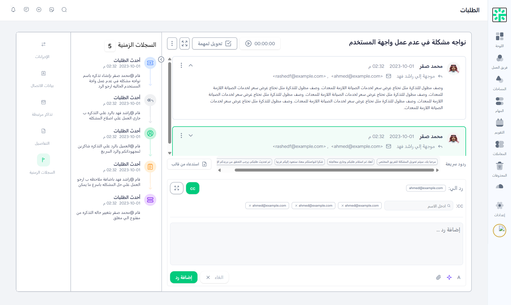

<p align="center"><a href="https://laravel.com" target="_blank"></a></p>

<p align="center">
<a href="https://github.com/laravel/framework/actions"></a>
<a href="https://packagist.org/packages/laravel/framework"></a>
<a href="https://packagist.org/packages/laravel/framework"></a>
<a href="https://packagist.org/packages/laravel/framework"></a>
</p>

## About Laravel

Laravel is a web application framework with expressive, elegant syntax. We believe development must be an enjoyable and creative experience to be truly fulfilling. Laravel takes the pain out of development by easing common tasks used in many web projects, such as:

- [Simple, fast routing engine](https://laravel.com/docs/routing).
- [Powerful dependency injection container](https://laravel.com/docs/container).
- Multiple back-ends for [session](https://laravel.com/docs/session) and [cache](https://laravel.com/docs/cache) storage.
- Expressive, intuitive [database ORM](https://laravel.com/docs/eloquent).
- Database agnostic [schema migrations](https://laravel.com/docs/migrations).
- [Robust background job processing](https://laravel.com/docs/queues).
- [Real-time event broadcasting](https://laravel.com/docs/broadcasting).

Laravel is accessible, powerful, and provides tools required for large, robust applications.

## Screenshots

### Ticket Page



## Notes

Cloned from Figma design file by [figma file](https://www.figma.com/design/on2zRep5FcEAZwnI9fVe2b/%D8%B4%D8%A7%D8%B4%D8%A7%D8%AA-%D8%A7%D9%84%D8%B7%D9%84%D8%A8%D8%A7%D8%AA?node-id=0-1&p=f&t=CV32oL5tkAWHGxtC-0)

## Prerequisites

Before you begin, ensure you have the following installed on your system:

- **PHP** >= 8.1
- **Composer** (latest version)
- **Node.js** >= 16.x and **npm** >= 8.x
- **MySQL** >= 5.7 or **PostgreSQL** >= 10 or **SQLite** >= 3.8
- **Git**

### Optional but Recommended

- **Redis** (for caching and queue management)
- **Docker** (for containerized development)

## Installation & Setup

### 1. Clone the Repository

```bash
git clone <your-repository-url>
cd <project-directory>
```

### 2. Install PHP Dependencies

```bash
composer install
```

### 3. Install JavaScript Dependencies

```bash
npm install
```

### 4. Environment Configuration

Copy the example environment file and generate an application key:

```bash
cp .env.example .env
php artisan key:generate
```

### 5. Configure Your Database

Open the `.env` file and update the database credentials:

```env
DB_CONNECTION=mysql
DB_HOST=127.0.0.1
DB_PORT=3306
DB_DATABASE=your_database_name
DB_USERNAME=your_database_user
DB_PASSWORD=your_database_password
```

### 6. Run Database Migrations

```bash
php artisan migrate
```

If you want to seed the database with sample data:

```bash
php artisan db:seed
```

Or run both migration and seeding together:

```bash
php artisan migrate --seed
```

### 7. Build Frontend Assets

For development:
```bash
npm run dev
```

For production:
```bash
npm run build
```

### 8. Start the Development Server

```bash
php artisan serve
```

The application will be available at `http://localhost:8000`

## Additional Configuration

### Storage Link

Create a symbolic link from `public/storage` to `storage/app/public`:

```bash
php artisan storage:link
```

### Queue Workers (Optional)

If your application uses queues, run the queue worker:

```bash
php artisan queue:work
```

### Task Scheduling (Optional)

If you're using Laravel's task scheduler, add this cron entry:

```bash
* * * * * cd /path-to-your-project && php artisan schedule:run >> /dev/null 2>&1
```

## Running Tests

Run the test suite:

```bash
php artisan test
```

Or using PHPUnit directly:

```bash
./vendor/bin/phpunit
```

## Docker Setup (Alternative)

If you prefer using Docker, you can use Laravel Sail:

```bash
./vendor/bin/sail up
```

For first-time setup with Sail:

```bash
./vendor/bin/sail artisan migrate
./vendor/bin/sail npm install
./vendor/bin/sail npm run dev
```

## Common Issues & Troubleshooting

### Permission Issues

If you encounter permission errors, set proper permissions:

```bash
chmod -R 775 storage bootstrap/cache
chown -R www-data:www-data storage bootstrap/cache
```

### Clear Cache

If you experience unexpected behavior, try clearing the cache:

```bash
php artisan cache:clear
php artisan config:clear
php artisan route:clear
php artisan view:clear
```

## Project Structure

```
├── app/                # Application core code
├── bootstrap/          # Application bootstrapping
├── config/             # Configuration files
├── database/           # Migrations, factories, and seeds
├── public/             # Public assets
├── resources/          # Views, CSS, and JavaScript
├── routes/             # Route definitions
├── storage/            # File storage
├── tests/              # Test files
└── vendor/             # Composer dependencies
```

## Learning Laravel

Laravel has the most extensive and thorough [documentation](https://laravel.com/docs) and video tutorial library of all modern web application frameworks, making it a breeze to get started with the framework.

You may also try the [Laravel Bootcamp](https://bootcamp.laravel.com), where you will be guided through building a modern Laravel application from scratch.

If you don't feel like reading, [Laracasts](https://laracasts.com) can help. Laracasts contains thousands of video tutorials on a range of topics including Laravel, modern PHP, unit testing, and JavaScript. Boost your skills by digging into our comprehensive video library.

## Laravel Sponsors

We would like to extend our thanks to the following sponsors for funding Laravel development. If you are interested in becoming a sponsor, please visit the [Laravel Partners program](https://partners.laravel.com).

### Premium Partners

- **[Vehikl](https://vehikl.com/)**
- **[Tighten Co.](https://tighten.co)**
- **[WebReinvent](https://webreinvent.com/)**
- **[Kirschbaum Development Group](https://kirschbaumdevelopment.com)**
- **[64 Robots](https://64robots.com)**
- **[Curotec](https://www.curotec.com/services/technologies/laravel/)**
- **[Cyber-Duck](https://cyber-duck.co.uk)**
- **[DevSquad](https://devsquad.com/hire-laravel-developers)**
- **[Jump24](https://jump24.co.uk)**
- **[Redberry](https://redberry.international/laravel/)**
- **[Active Logic](https://activelogic.com)**
- **[byte5](https://byte5.de)**
- **[OP.GG](https://op.gg)**

## Contributing

Thank you for considering contributing to the Laravel framework! The contribution guide can be found in the [Laravel documentation](https://laravel.com/docs/contributions).

## Code of Conduct

In order to ensure that the Laravel community is welcoming to all, please review and abide by the [Code of Conduct](https://laravel.com/docs/contributions#code-of-conduct).

## Security Vulnerabilities

If you discover a security vulnerability within Laravel, please send an e-mail to Taylor Otwell via [taylor@laravel.com](mailto:taylor@laravel.com). All security vulnerabilities will be promptly addressed.

## License

The Laravel framework is open-sourced software licensed under the [MIT license](https://opensource.org/licenses/MIT).